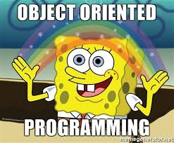

# UML SMI5  

---

## Software Engineer Goal

---

---

What, Why , How?

---

## Object Oriented Programming

---

Everything is an object

---

### Principles of object-oriented programming

---

Question

---

---

### Abstraction (representing)

---

Question

---
<!-- 
    
-->
Objects in an OOP language provide an abstraction that hides the internal implementation details. Similar to the coffee machine in your kitchen, you just need to know which methods of the object are available to call and which input parameters are needed to trigger a specific operation. But you don’t need to understand how this method is implemented and which kinds of actions it has to perform to create the expected result.

---

---

### Classification

---

Question

---

---

### Encapsulation

---

Question

---

 showcasing only the required things to the outside world while hiding the details. Continuing our example, Human Being's can talk, walk, hear, eat, but the details are hidden from the outside world. We can take our skin as the Abstraction factor in our case, hiding the inside mechanism.

---

---

### Association (Relating)

---

Question

---

Objects are classified and abstracted into classes. Classes don’t exist in isolation. They relate to other classes in multiple ways. The association relationship is a mechanism for two (more) classes to relate to each other. For example, the class Person associating with the class Clock in order to achieve the objective of, say, “find the time.” There can be many additional associations between Person and Clock such as “changing the batteries of a clock,” “buying a clock,” or “setting the time.”

---

---

### Inheritance (Generalizing)

---

Question

---

Considering HumanBeing a class, which has properties like hands, legs, eyes etc, and functions like walk, talk, eat, see etc. Male and Female are also classes, but most of the properties and functions are included in HumanBeing, hence they can inherit everything from class HumanBeing using the concept of Inheritance.

---

### Polymorphism (Executing)

---

Question

---

Polymorphism is a concept, which allows us to redefine the way something works, by either changing how it is done or by changing the parts using which it is done. Both the ways have different terms for them.

If we walk using our hands, and not legs, here we will change the parts used to perform something. Hence this is called **Overloading**.

And if there is a defined way of walking, but I wish to walk differently, but using my legs, like everyone else. Then I can walk like I want, this will be called as **Overriding**.

---

---

---

### Class

---

Here we can take Human Being as a class. A class is a blueprint for any functional entity which defines its properties and its functions. Like Human Being, having body parts, and performing various actions.

---

### Objects

---

My name is Taha, and I am an instance/object of class Male. When we say, Human Being, Male or Female, we just mean a kind, you, your friend, me we are the forms of these classes. We have a physical existence while a class is just a logical definition. We are the objects.

---

Questions?

---

### Positives

---

- Design first then code
- resue of code
- easy to maintain and modify

---

## Association

---

<!-- ri7t che7ma fi cha9our -->

---

    class Department
    {
    int DeptID;
    String DeptName;
    int[] AllDoctors;
    int HospitalID;
    // Start Methods
    // Getters and Setters
        Doctor getDoctor(int doctorId){
        }
        Hospital getHospital(Hospital hospitals){
        }
    }

---

---

Ask Questions?

---

## Agregation: Has-A

---
An aggregation relationship is a specialized form of association. In aggregation, classes are related more closely to each other than in an association relationship. Aggregation can be described as a whole–part relationship wherein an entity is “made up of” or “composed of” other entities, or classes.

---

---

    class Department
    {
    int DeptID;
    String DeptName;
    int[] AllDoctors;
    int HospitalID;
    // Methods
    // Getters and Setters
    }
    
    class Hospital
    {
        int HospitalID;
        String HospitalName;
        Department[] AllDepartments;
        Address HospitalAddress;
        // Methods
        //Getters and setters
    }

---

Ask Questions?

---

## Composition: part-of

---

---

    class Department
    {
    int DeptID;
    String DeptName;
    int[] AllDoctors;
    int HospitalID;
    // Methods
    // Getters and Setters
    }
    
    class Hospital
    {
        int HospitalID;
        String HospitalName;
        Department department;
        Address HospitalAddress;
        // Methods
        //Getters and setters
        //Constructor
        Hospital(... , department,...){
            this.departement = departement
        }
    }

---

Ask Questions?

---

## Association classes

---

---

## Generalization/Specialization

---

---

    class Animal extends Living{
        //tkherbi9
    }
    class Bird extends Living{
        //Tkherbi9 zayd
    }
    class Living{

    }

---

## Polymorphism

---

    class Animal{
        // Atributes
        // getters and setters
        abstract String speak();
    }
    class Dog extends Animal{
        String speak(){
            return "Haw Haw";
        }
    }
    class Cat extends Animal{
        String speak(){
            return "Meow";
        }
    }
    class Sheep extends Animal{
        String speak(){
            return "ba333";
        }
    }
    class Test{
        public main(String *args){
            Animal micho = new Cat();
            Animal boby = new Dog();
            Animal chwa = new Sheep();
            micho.speak();
            boby.speak();
            chwa.speak();
        }
    }

---

## Diagram types

---

---

### Use Case Diagram

---

Provides an overview of functionality of the system or
business processes from a user perspective. The way in
which a user “uses” the system is the starting point for
creating a use case diagram.

---

---

Ask Question?

---

### Activity Diagram

---

Models the flow anywhere in the system. In particular, the
flow within a use case describing normal user interactions
and the alternatives and exceptions is very well modeled by
these activity diagrams.

---

---

Ask Question?

---

### State Machine : Etat Transition

---

Shows the runtime life cycle of an object in memory. Such a
life cycle includes all the states of an object and the
conditions under which the states change.

---

---

### Class Diagram

---

Represents classes, their definitions, and relationships.
Classes and entities from the problem space are
also detailed technical entities in the solution space.
The attributes and operations that define the classes
are included within this class diagram. Relationships in a
class diagram illustrate how classes interact, collaborate,
and inherit from other classes. Classes can also
represent relational tables, user interfaces, and
controllers.

---

---

Ask Question?

---

### Objet Diagram

---

Shows objects and their links in the memory at runtime.
Therefore, these object diagrams also help visualize
multiplicities in practice.

---

---

Ask Question?

---

### Sequence Diagrams

---

Models the interactions between objects based on their
timelines. Objects can be specifically shown on these
diagrams or they can be anonymous objects belonging to a
class. The sequence of execution of messages between
objects at runtime is well modeled by these diagrams,
hence their name.

---

---

Ask Question?

---

<!-- this is a note -->

Reference:
Book: Software Engineering with UML
Link: https://www.geeksforgeeks.org/association-composition-aggregation-java/
